# Diagramas del Sistema

## Arquitectura del Sistema

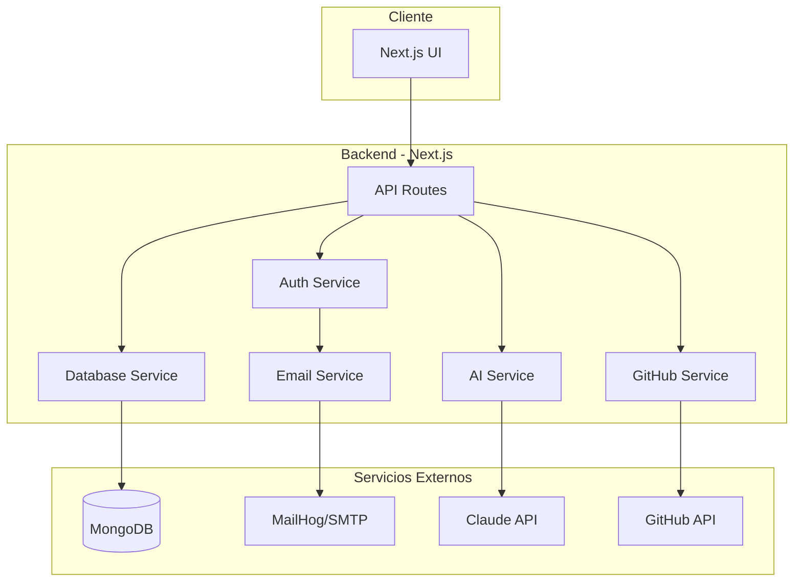

## Modelo de Datos

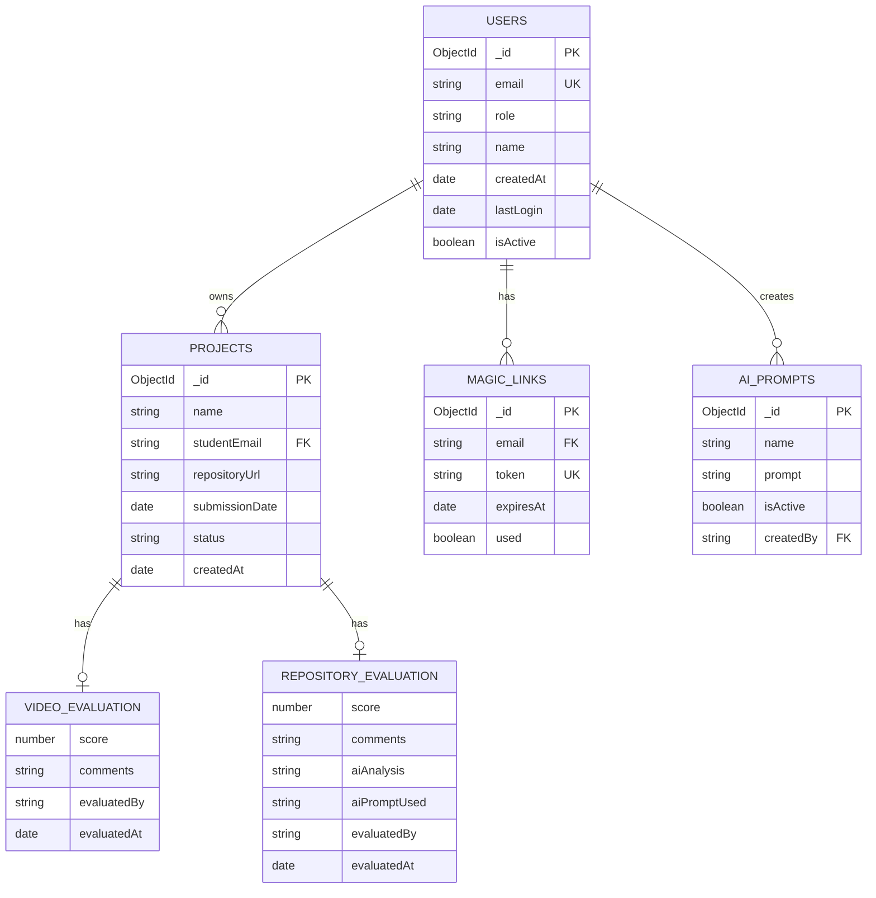

## Flujo de Autenticación

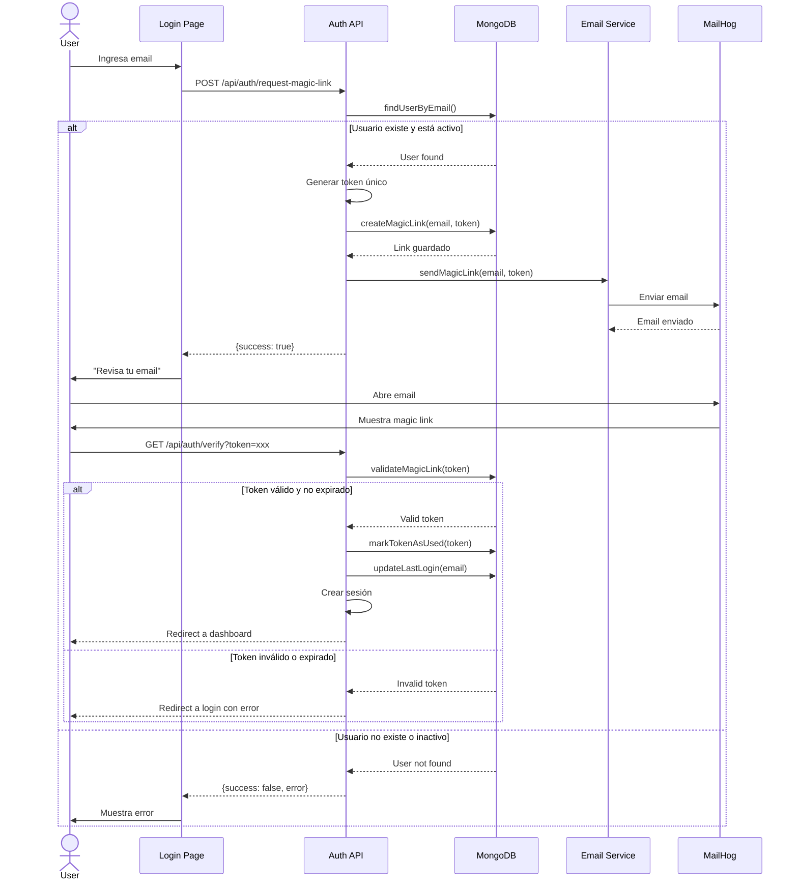

## Flujo de Creación de Proyecto

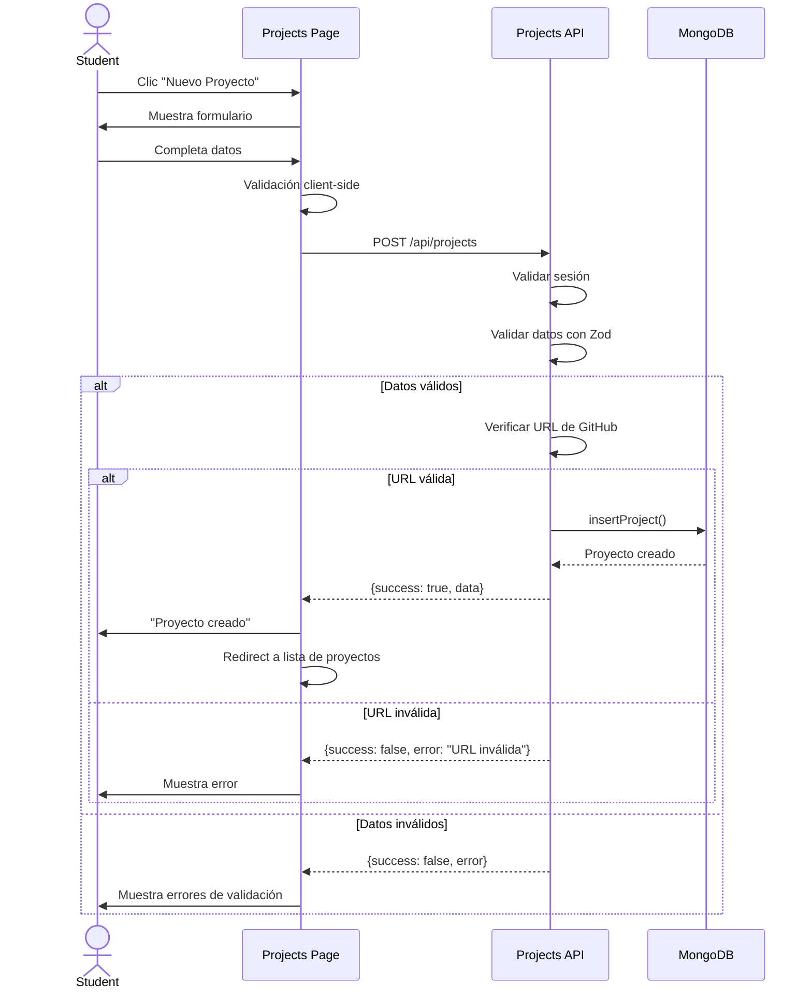

## Flujo de Evaluación con IA

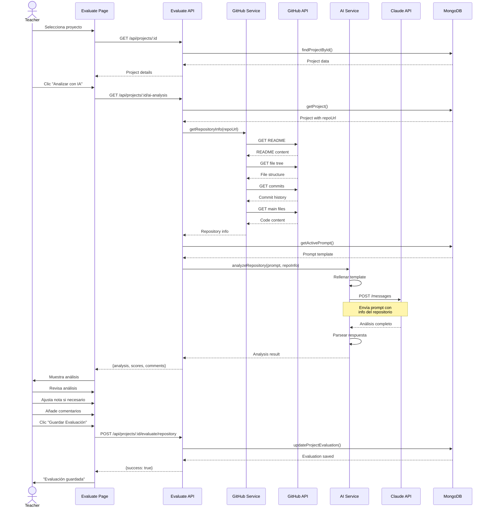

## Flujo de Gestión de Usuarios (Admin)

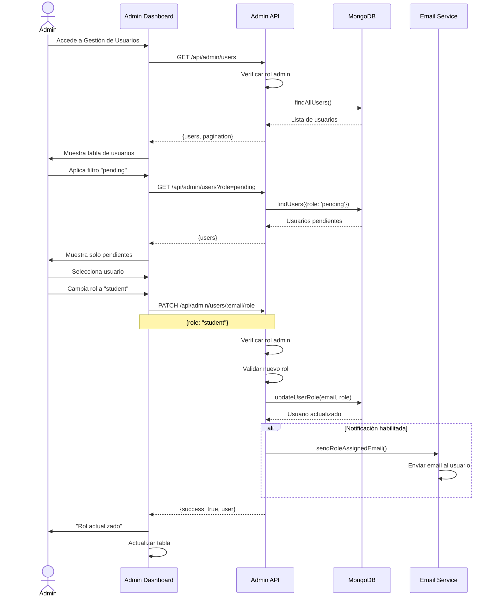

## Estados de un Proyecto

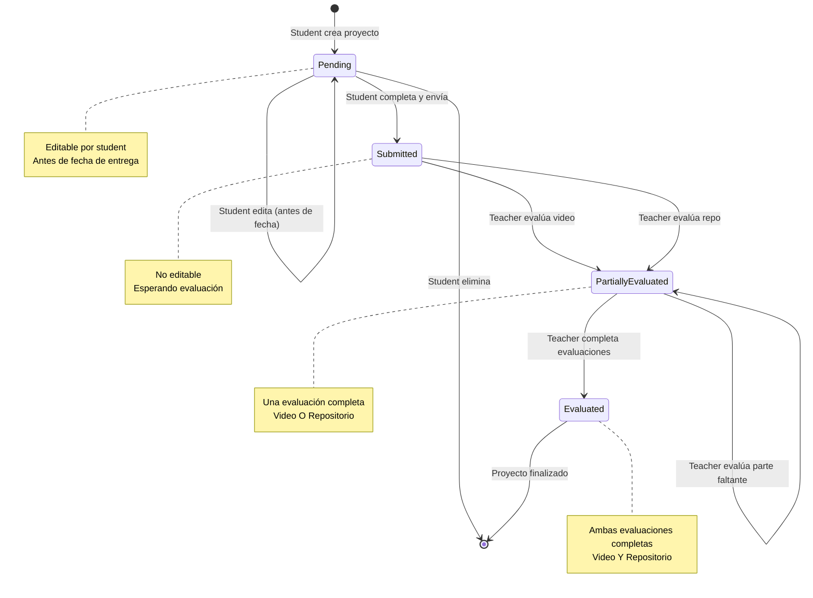

## Roles y Permisos

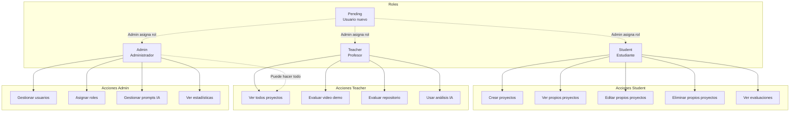

## Arquitectura de Carpetas

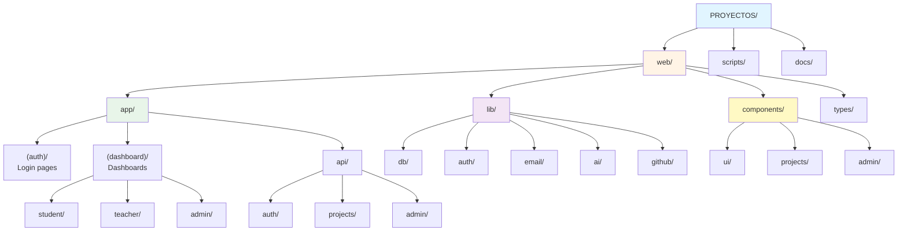

## Flujo de Datos en Evaluación

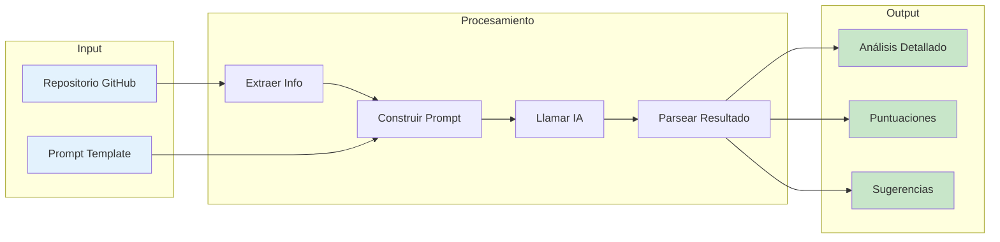

## Ciclo de Vida de un Token

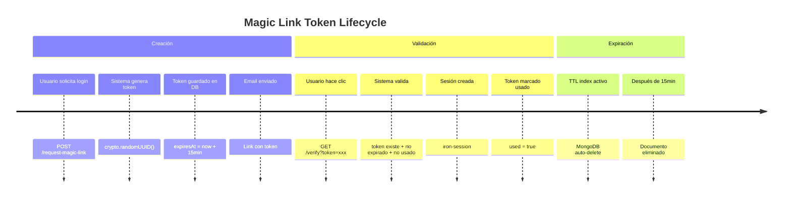

## Integración con Servicios Externos

```mermaid
graph TB
    App[Next.js App]

    subgraph "Base de Datos"
        Mongo[MongoDB<br/>localhost:27017]
    end

    subgraph "Email"
        Mail[MailHog<br/>localhost:1025]
        MailUI[MailHog UI<br/>localhost:8025]
    end

    subgraph "IA"
        Claude[Claude API<br/>api.anthropic.com]
    end

    subgraph "GitHub"
        GitHubAPI[GitHub API<br/>api.github.com]
    end

    App -->|MongoDB Driver| Mongo
    App -->|Nodemailer| Mail
    Mail --> MailUI
    App -->|@anthropic-ai/sdk| Claude
    App -->|@octokit/rest| GitHubAPI

    style App fill:#1976d2,color:#fff
    style Mongo fill:#4caf50,color:#fff
    style Mail fill:#ff9800,color:#fff
    style Claude fill:#9c27b0,color:#fff
    style GitHubAPI fill:#000,color:#fff
```

## Middleware Flow

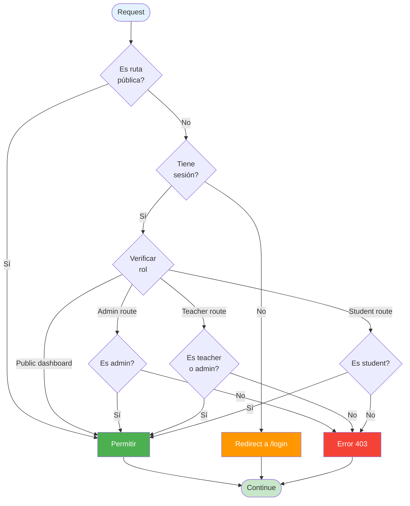
